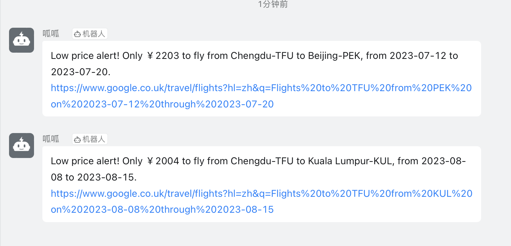
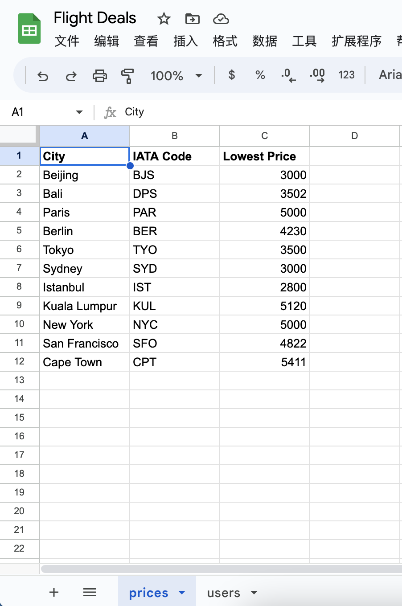

# Flight Price Monitoring and Notifications

Flight Club is a Python application that helps you monitor flight prices and sends notifications via Dingtalk. With Flight Club, you can track flight prices for various destinations and receive alerts when the prices drop below a certain threshold.



## Features

- Query flight prices using the Kiwi API
- Retrieve destination data from a Google Sheet
- Automatically update IATA codes for destinations
- Send notifications via Dingtalk when prices meet the criteria
- Subscription can be enabled with limited update on `main.py` and `notification_manager.py`

## Setup

1. Clone the repository:

   ```bash
   git clone https://github.com/your-username/flight-club.git
   ```

2. Install the required dependencies:

   ```bash
   pip install -r requirements.txt
   ```

3. Create a Google Sheet for flight details and link to

   

4. Link google sheet to [Sheety](https://sheety.co/) and create sheety authentication token.

5. Create a API key for flight search from [KIWI](https://tequila.kiwi.com/portal/getting-started)

6. Get Dingtalk token and secret from [Dingtalk](https://open.dingtalk.com/document/orgapp/custom-robot-access)

7. Set up the necessary environment variables:

   - `SHEETY_FLIGHT`: Google Sheet API endpoint for flight data
   - `SHEETY_FLIGHT_AUTH`: Authorization token for the Google Sheet API
   - `KIWI_API_KEY`: API key for the Kiwi API
   - `GUA_TOKEN`: Access token for the Dingtalk Chatbot
   - `GUA_SECRET`: Secret key for the Dingtalk Chatbot

8. Run the `main.py` script:

   ```bash
   python main.py
   ```

🛫 Enjoy and have fun!
